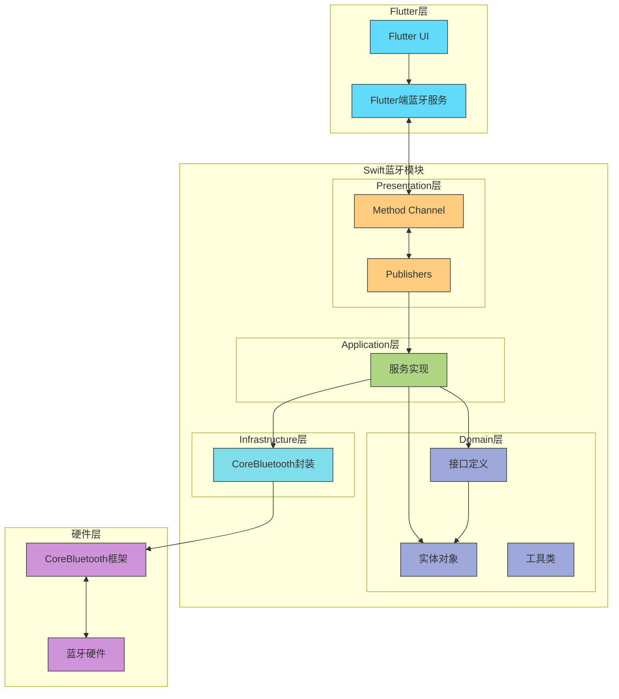
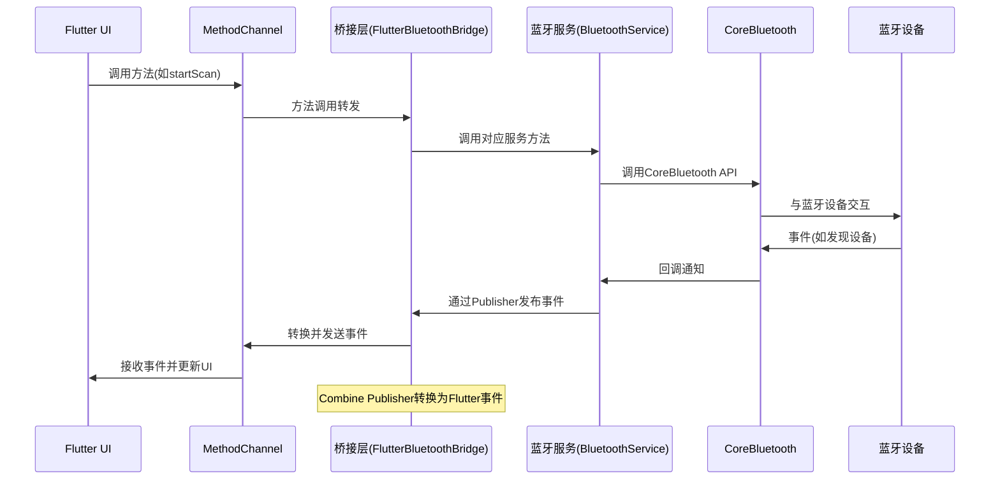
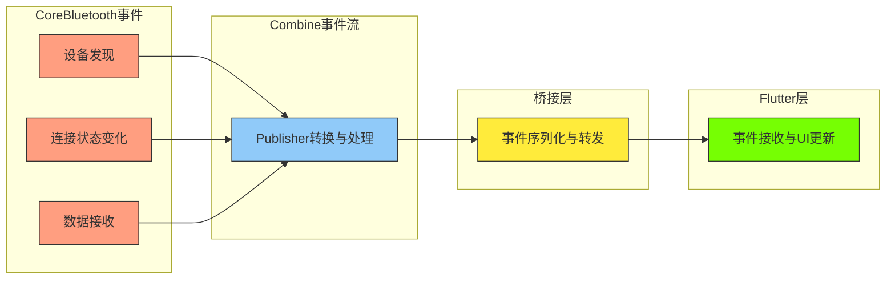
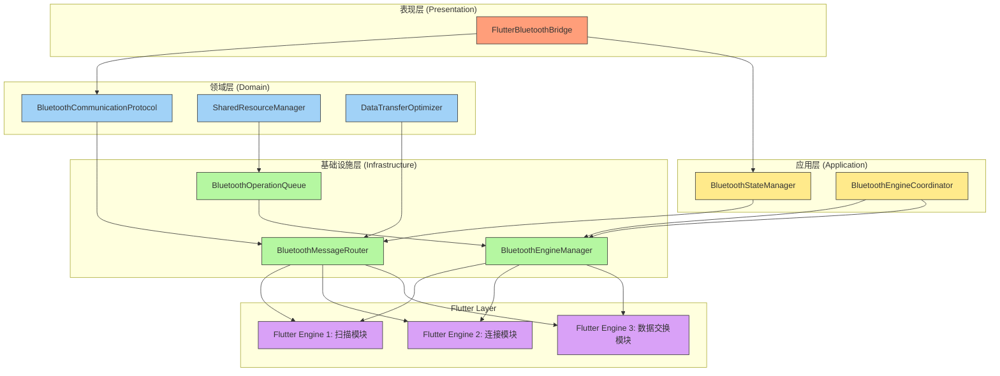
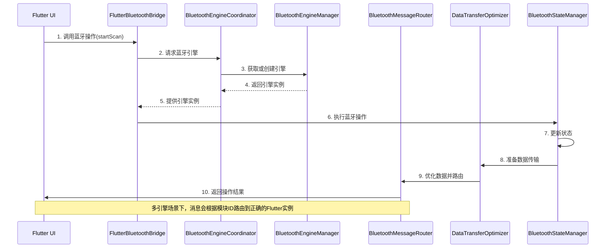
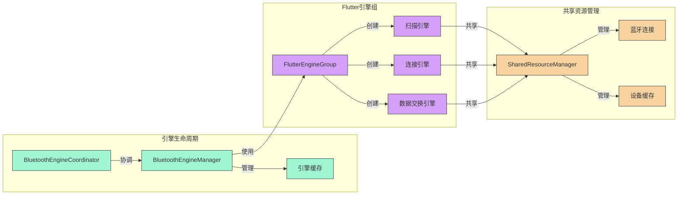

## 蓝牙模块开发指南
### 蓝牙模块架构设计
蓝牙模块采用了清晰的分层架构设计，遵循领域驱动设计(DDD)原则，使代码结构清晰、职责分明、易于扩展和维护。

#### 模块分层
```
BluetoothModule/
├── Domain/                  # 领域层
│   ├── Entities/            # 实体对象
│   ├── Interfaces/          # 接口定义
│   └── Utils/               # 工具类
├── Infrastructure/          # 基础设施层
│   └── CoreBluetooth/       # CoreBluetooth封装
├── Application/             # 应用层
│   └── Services/            # 服务实现
└── Presentation/            # 表示层
    └── Publishers/          # Flutter通信
```

蓝牙模块架构设计流程图及交互说明
架构分层图
下面这个流程图展示了蓝牙模块的分层架构，以及各层之间的依赖关系和主要职责：


数据流通信图
以下流程图展示了数据如何在Flutter和蓝牙模块之间流动：


## 响应式事件处理流程


### 蓝牙模块与外界交互说明
#### 1. 与Flutter UI层的交互
蓝牙模块通过专门的桥接层与Flutter UI进行双向通信：
 Flutter到Swift方向：
   - Flutter通过MethodChannel调用原生方法
   - 方法名称映射到特定蓝牙操作（如扫描、连接、发送数据）
   - 参数通过标准JSON格式传递
 Swift到Flutter方向：
   - Swift端将蓝牙事件通过Combine Publisher发布
   - 桥接层订阅这些事件并转换为Flutter可理解的格式
   - 通过MethodChannel.invokeMethod方法推送给Flutter
   - Flutter端注册事件监听器接收并处理这些事件

#### 2. 与底层蓝牙硬件的交互
蓝牙模块通过CoreBluetooth框架与底层硬件交互：
 基础设施层封装：
   - 封装了CoreBluetooth的复杂API为简洁接口
   - 处理权限请求、状态监控和错误处理
   - 将回调式API转换为响应式流
   - 通信协议处理：
     - 支持BLE（低功耗蓝牙）的GATT协议
     - 处理服务(Service)和特征值(Characteristic)的发现与操作
     - 提供读、写、通知订阅的统一接口

#### 3. 与其他模块的集成
蓝牙模块设计为可与应用中其他模块无缝集成：
 与日志模块集成：
   - 重要事件和错误通过应用的日志系统记录
   - 提供调试级别的细粒度日志
 与配置模块集成：
   - 从应用配置中读取蓝牙参数（如扫描时长、重连策略）
   - 支持动态配置更新
 与安全模块集成：
   - 支持蓝牙通信加密
   - 遵循数据安全策略处理敏感信息

#### 4. 错误处理与恢复机制
蓝牙模块实现了完善的错误处理流程：
  - 分级错误处理：
    - 基础设施层捕获并转换CoreBluetooth错误
    - 应用层添加业务上下文并实现重试逻辑
    - 表示层将错误转换为用户友好的消息
  - 自动恢复机制：
    - 监控蓝牙状态变化并自动适应
    - 实现连接断开后的重连策略
    - 定期刷新扫描以发现新设备

通过这种分层设计和清晰的通信机制，蓝牙模块能够提供稳定可靠的蓝牙功能，同时保持代码的可维护性和可测试性。

#### 蓝牙模块通信机制
蓝牙模块的通信机制主要分为两部分：内部通信和与Flutter的通信。

1. 内部通信 - Combine框架
模块内部使用Swift的Combine框架实现响应式编程模式，具有以下优势：
声明式编程：通过数据流处理，代码更加简洁
自动资源管理：自动处理订阅取消，避免内存泄漏
链式操作：支持函数式变换，如map、filter等
组合能力：可以组合多个数据流
核心Publisher：

```swift
// BluetoothService中的Publisher
var statePublisher: AnyPublisher<BluetoothState, Never>
var devicesPublisher: AnyPublisher<[BluetoothDevice], Never>
var connectedDevicePublisher: AnyPublisher<BluetoothDevice?, Never>
var messagesPublisher: AnyPublisher<BluetoothMessage, Never>
```

2. 与Flutter通信 - MethodChannel
使用FlutterMethodChannel建立Swift与Dart之间的通信桥梁：
```swift
// Swift端
private let methodChannel: FlutterMethodChannel = FlutterMethodChannel(
    name: "com.example.swiftflutter/bluetooth", 
    binaryMessenger: binaryMessenger
)

// Dart端
static const MethodChannel _channel = MethodChannel('com.example.swiftflutter/bluetooth');
```

3. 消息格式
通信采用统一的BluetoothMessage格式封装不同类型的消息：
```swift
struct BluetoothMessage: Codable {
    let type: BluetoothMessageType
    let data: [String: Any]?
    let timestamp: Date
}

// 消息类型
enum BluetoothMessageType: String, Codable {
    case stateChanged = "STATE_CHANGED"
    case scanStarted = "SCAN_STARTED"
    // ...更多类型
}
```

#### 蓝牙模块常见问题与解答

 问题1: 蓝牙扫描无法发现设备
 原因：可能是权限问题、蓝牙未开启、设备未广播或过滤条件设置不当。
 解决方案：
 1. 确保在Info.plist中添加蓝牙使用权限
 2. 检查蓝牙状态是否为.ready
 3. 调用startScan时不要添加过滤条件，以扫描所有设备
 4. 检查目标设备是否处于广播状态
```swift
// 开始扫描所有设备
bluetoothService.startScan(withServices: nil)
```

问题2: 蓝牙连接失败或频繁断开
原因：设备距离过远、信号干扰、设备已连接其他客户端或设备电量不足。
解决方案：
1. 实现重连机制，监听连接状态变化
2. 在连接前确保断开已有连接
3. 添加超时处理，避免连接卡死
```swift
// 连接前先断开已有连接
if connectedDeviceSubject.value != nil {
    repository.disconnect()
}
```
问题3: 特征值读写操作失败
原因：权限不足、特征值不支持读写操作或操作时机不当。
解决方案：
1. 确认特征值是否支持读写（检查properties）
2. 确保连接状态稳定再进行读写操作
3. 使用适当的写入类型（withResponse/withoutResponse）
```swift
// 检查特征值是否支持读取
if !characteristic.canRead {
    // 处理不支持读取的情况
    return
}
```
问题4: 通知订阅不工作
原因：特征值不支持通知、未正确设置通知或忘记保持订阅。
解决方案：
1. 检查特征值是否支持通知（properties.contains(.notify)）
2. 确保正确调用setNotify(enabled: true)
3. 保存返回的Publisher，避免被提前释放
```swift
// 确保特征值支持通知
if !characteristic.canNotify {
    // 处理不支持通知的情况
    return
}
```
问题5: Flutter与Native通信延迟或消息丢失
原因：消息队列阻塞、大数据传输效率低或线程安全问题。
解决方案：
1. 避免在主线程进行耗时操作
2. 大数据分片传输
3. 使用高效的数据编码（如Base64）
4. 实现消息确认机制
```swift
// 使用Base64进行数据编码
result(data.base64EncodedString())
```

### 最佳实践
1 错误处理：所有蓝牙操作都应有完善的错误处理机制
```swift
func connect(to device: BluetoothDevice) {
       // 先处理边界条件
       guard bluetoothStateSubject.value == .ready else {
           messagesSubject.send(
               BluetoothMessage(
                   type: .error,
                   data: ["error": BluetoothError.notReady.localizedDescription]
               ))
           return
       }
       // 正常流程...
   }
```

2 资源管理：正确管理订阅和连接资源
```swift
// 使用AnyCancellable集合管理订阅
   private var cancellables = Set<AnyCancellable>()
   
   // 在不需要时取消订阅
   subscription.cancel()
```

3 状态同步：保持Flutter和Native层状态同步
```swift
   // 监听状态变化并通知Flutter
   bluetoothService.statePublisher
       .sink { [weak self] state in
           let message = BluetoothMessage(type: .stateChanged, data: ["state": state.rawValue])
           self?.messagesSubject.send(message)
       }
       .store(in: &cancellables)
```

### 为什么在蓝牙层使用Combine进行事件封装及其与Flutter的通信机制
使用Combine框架封装蓝牙事件具有以下几个核心优势：
1. 响应式编程模式
```swift
// 使用Combine进行事件封装
let bluetoothService = BluetoothService()
bluetoothService.startScan()
    .sink { result in
        // 处理扫描结果
    }
```
2. 异步事件处理
蓝牙操作本质上是异步的，如扫描、连接、数据传输等。Combine提供了优雅的异步事件处理方式：
```swift
// 异步处理蓝牙扫描结果
bluetoothManager.scanForDevicesPublisher()
    .receive(on: DispatchQueue.main)
    .sink { devices in
        // 处理扫描到的设备
    }
    .store(in: &cancellables)
```
3. 事件变换与组合
Combine允许对事件流进行函数式变换，提高代码可读性：
```swift
// 过滤并转换蓝牙消息
messagesPublisher
    .filter { $0.type == .dataReceived }
    .map { $0.data }
    .sink { data in
        // 处理接收到的数据
    }
    .store(in: &cancellables)
```
4. 资源自动管理
Combine的订阅自动管理机制避免了内存泄漏风险：
```swift
// 使用Set统一管理订阅生命周期
private var cancellables = Set<AnyCancellable>()
```

中间层桥接机制
是的，存在一个中间层用于在Combine和Flutter之间进行事件流桥接，这个中间层通常位于Presentation/Publishers目录中，通过FlutterBluetoothBridge类实现。
桥接实现过程
1. 桥接层的基本结构
```swift
class FlutterBluetoothBridge {
    private let methodChannel: FlutterMethodChannel
    private let bluetoothService: BluetoothService
    private var cancellables = Set<AnyCancellable>()
    
    init(binaryMessenger: FlutterBinaryMessenger, bluetoothService: BluetoothService) {
        self.methodChannel = FlutterMethodChannel(name: "com.example.swiftflutter/bluetooth", 
                                                 binaryMessenger: binaryMessenger)
        self.bluetoothService = bluetoothService
        setupMethodCallHandler()
        setupPublishers()
    }
}
```

2. 从Combine到Flutter的桥接
通过订阅Combine的Publisher，将事件转发到Flutter：
```swift
private func setupPublishers() {
    // 订阅蓝牙状态变化
    bluetoothService.statePublisher
        .sink { [weak self] state in
            // 将状态转换为Flutter可理解的格式
            let stateMap: [String: Any] = ["state": state.rawValue]
            // 通过MethodChannel发送到Flutter
            self?.methodChannel.invokeMethod("onStateChanged", arguments: stateMap)
        }
        .store(in: &cancellables)
        
    // 订阅设备发现事件
    bluetoothService.devicesPublisher
        .sink { [weak self] devices in
            // 转换设备列表为Flutter可用格式
            let devicesList = devices.map { $0.toDictionary() }
            self?.methodChannel.invokeMethod("onDevicesDiscovered", arguments: devicesList)
        }
        .store(in: &cancellables)
        
    // 其他事件订阅...
}
```

3. 从Flutter到Combine的桥接
通过设置MethodChannel处理器，将Flutter的调用转换为对蓝牙服务的操作：
```swift
private func setupMethodCallHandler() {
    methodChannel.setMethodCallHandler { [weak self] (call, result) in
        guard let self = self else { return }
        
        switch call.method {
        case "startScan":
            self.bluetoothService.startScan()
            result(nil)
            
        case "stopScan":
            self.bluetoothService.stopScan()
            result(nil)
            
        case "connect":
            guard let deviceId = call.arguments as? String else {
                result(FlutterError(code: "INVALID_ARGUMENT", 
                                   message: "Expected device ID", 
                                   details: nil))
                return
            }
            
            // 从ID获取设备并连接
            if let device = self.bluetoothService.getDevice(byId: deviceId) {
                self.bluetoothService.connect(to: device)
                result(nil)
            } else {
                result(FlutterError(code: "DEVICE_NOT_FOUND", 
                                   message: "Device not found", 
                                   details: nil))
            }
            
        // 处理其他方法调用...
        
        default:
            result(FlutterMethodNotImplemented)
        }
    }
}
```

数据序列化机制
为了在不同平台间传输数据，桥接层需要进行数据序列化：
```swift
// Swift端的模型转换为字典
extension BluetoothDevice {
    func toDictionary() -> [String: Any] {
        return [
            "id": id,
            "name": name ?? "",
            "rssi": rssi,
            "isConnected": isConnected
        ]
    }
}

// Flutter端处理接收到的数据
class BluetoothDevice {
  final String id;
  final String name;
  final int rssi;
  final bool isConnected;
  
  BluetoothDevice.fromMap(Map<String, dynamic> map)
      : id = map['id'],
        name = map['name'] ?? '',
        rssi = map['rssi'] ?? 0,
        isConnected = map['isConnected'] ?? false;
}
```

### 总结
蓝牙模块采用Combine框架主要是为了利用响应式编程模式处理异步事件，同时通过中间桥接层（FlutterBluetoothBridge）实现与Flutter的双向通信。这种架构提供了以下优势：
1. 清晰的关注点分离 - 蓝牙核心逻辑与平台交互解耦
2. 代码可维护性强 - 响应式编程使异步逻辑更清晰
3. 统一的事件处理模型 - 在整个蓝牙模块中保持一致性
4. 易于测试 - 可以独立测试蓝牙核心功能，不依赖Flutter
这种架构也为未来扩展到其他平台（如Android）提供了灵活性，只需实现新的桥接层，而核心业务逻辑可以保持不变。

## Flutter Engine Group 在蓝牙模块架构中的定位
该蓝牙消息管理模块采用了清晰的分层架构设计，遵循领域驱动设计(DDD)原则。在 Flutter Engine Group 场景下，相关组件按照职责分布在不同的架构层次中。

## Flutter Engine Group 蓝牙模块架构设计流程图


## 数据流转与通信流程


## 资源共享与引擎生命周期管理

## 设计特点与优势
这种架构设计实现了以下目标：
1. 职责分离：每个组件都有明确的单一职责
    - BluetoothMessageRouter：专注于消息路由
    - BluetoothEngineManager：专注于引擎生命周期
    - DataTransferOptimizer：专注于数据优化
2. 资源共享：所有引擎共享核心资源
    - 通过 SharedResourceManager 实现
    - 避免重复创建昂贵资源
3. 性能优化：
    - 按需创建引擎
    - 惰性加载和预加载策略
    - 批处理和消息压缩
4. 灵活性：
    - 可独立更新各组件
    - 支持动态加载不同功能模块
    - 遵循开闭原则
这种架构设计使蓝牙模块能够高效地在 Flutter Engine Group 环境中运行，实现了功能隔离与资源共享的平衡，同时保持了代码的可维护性和扩展性。

## 架构层次与组件分布
1. 基础设施层 (Infrastructure)
负责技术实现细节，包括外部系统集成和基础服务：
    - BluetoothMessageRouter: 核心消息路由组件，属于通信基础设施
    - BluetoothEngineManager: 管理 Flutter 引擎生命周期，属于引擎基础设施
举例：当用户启动蓝牙扫描功能时，BluetoothEngineManager 负责创建或获取适当的 Flutter 引擎，而扫描结果则通过 BluetoothMessageRouter 路由到正确的 Flutter 实例。
```swift
// 创建蓝牙扫描引擎并发送消息的流程示例
let engine = engineManager.getOrCreateEngine(for: "bluetooth_scanner")
BluetoothMessageRouter.shared.sendMessage(
    to: "bluetooth_scanner", 
    method: "onDeviceFound",
    arguments: deviceJson
)
```

2. 应用层 (Application)
包含业务逻辑协调和服务实现：
    - BluetoothStateManager: 管理蓝牙状态并广播状态变化
    - BluetoothEngineCoordinator: 协调多引擎加载和使用策略
举例：当蓝牙状态变化时，BluetoothStateManager 负责将状态更新广播到所有活跃的 Flutter 引擎：
```swift
// 蓝牙状态变化时
func onBluetoothStateChanged(_ newState: BluetoothState) {
    // 更新内部状态
    BluetoothStateManager.shared.updateState(newState)
    
    // updateState方法内部会自动广播到所有引擎
    // 无需手动发送到各个引擎
}
```

3. 领域层 (Domain)
包含核心业务对象、接口和通用工具：
    - BluetoothCommunicationProtocol: 定义通信接口规范
    - SharedResourceManager: 管理共享资源
    - DataTransferOptimizer: 优化数据传输
举例：多个 Flutter 引擎共享相同的蓝牙连接和设备缓存：
```swift
// 不同引擎可以共享相同的蓝牙资源
let repository = SharedResourceManager.shared.getRepository()

// 使用优化器进行批量数据传输
DataTransferOptimizer().batchDeviceUpdates(devices, forEngine: "bluetooth_scanner")
```

4. 表现层 (Presentation)
负责用户界面和消息展示：
    - FlutterBluetoothBridge: 连接 Flutter UI 与原生蓝牙功能
举例：当从 Flutter 收到蓝牙操作请求时：
```swift
// Flutter UI 触发蓝牙扫描
// 在 FlutterBluetoothBridge 的 handleMethodCall 中
if call.method == "startScan" {
    bluetoothService.startScan()
        .sink(
            receiveCompletion: { completion in
                // 处理完成事件
            },
            receiveValue: { devices in
                // 将扫描结果发送回 Flutter
                let sender = FlutterBluetoothMessageSender(engineId: self.moduleId)
                for device in devices {
                    sender.sendDeviceDiscovered(device)
                }
            }
        )
        .store(in: &cancellables)
}
```

## 跨层级协作案例
在实际应用中，这些组件协同工作形成完整的功能流。以蓝牙设备扫描为例：
1. 用户触发扫描：Flutter UI 调用 startScan 方法
2. 消息路由：BluetoothMessageRouter 将请求路由到对应处理器
3. 引擎协调：BluetoothEngineCoordinator 确保扫描引擎已加载
4. 业务处理：蓝牙服务执行扫描并获取结果
5. 状态更新：BluetoothStateManager 更新并广播扫描状态
6. 结果优化：DataTransferOptimizer 优化扫描结果传输
7. 消息发送：FlutterBluetoothMessageSender 将结果发送回 Flutter

## 总结
这个 Flutter Engine Group 场景下的蓝牙消息管理模块是 BluetoothModule 架构的核心部分，横跨了从基础设施到表现层的各个层次。它通过精心设计的组件协作，实现了高效的多引擎通信、资源共享和性能优化，同时保持了代码的清晰结构和遵循 SOLID 原则的良好实践。